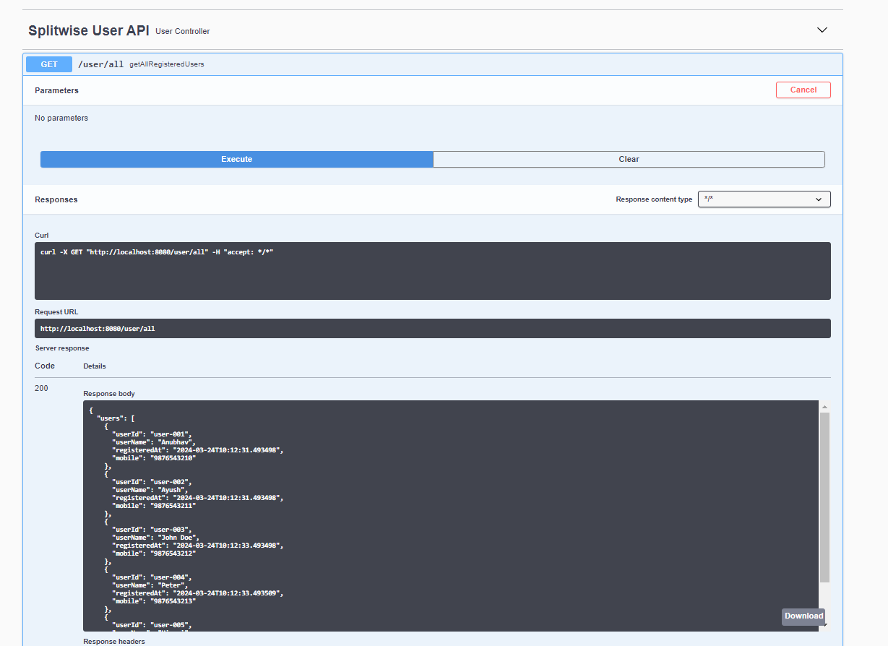
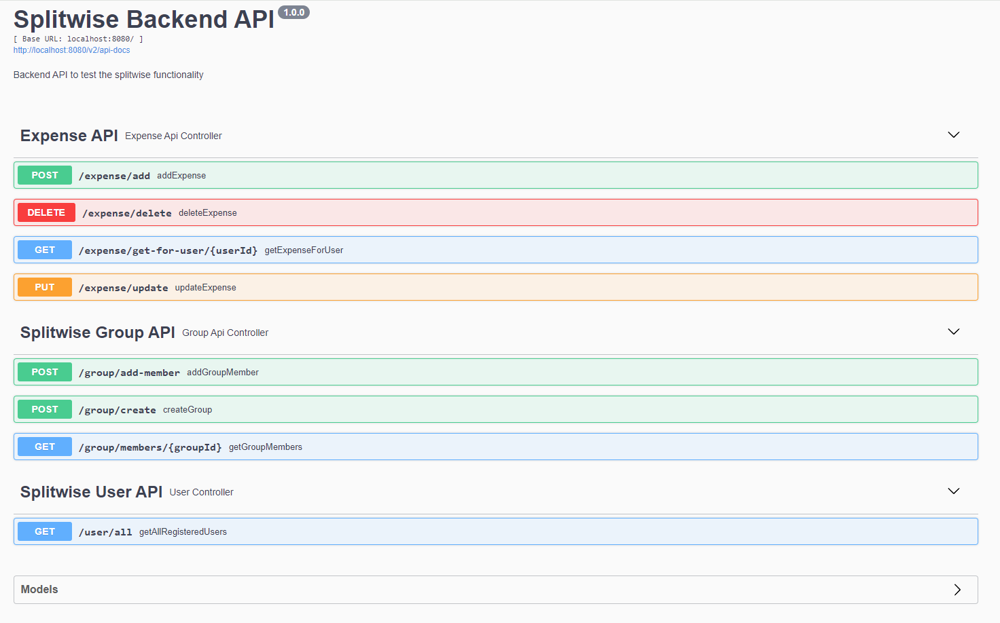

# Splitwise Backend

### Installations Required

1. Maven:
    - Make sure Maven is installed on your system. If not, you can download it from [Maven's official website](https://maven.apache.org/download.cgi) and follow the installation instructions for your operating system.

2. PostgreSQL (*or simply use docker*):
    - Install PostgreSQL on your machine if you haven't already. You can download it from [PostgreSQL's official website](https://www.postgresql.org/download/) and follow the installation instructions provided.

3. Java/JRE:
    - Ensure that Java or Java Runtime Environment (JRE) is installed on your system. You can download it from [Oracle's Java website](https://www.oracle.com/java/technologies/javase-jdk11-downloads.html) or use OpenJDK, depending on your preference and operating system.

### Setting Up the Project Locally

1. **Clone the Repository:**
    - Clone the project repository to your local machine using Git:
      ```
      git clone https://github.com/AnubhavHawk/splitwise-backend
      ```

2. **Navigate to the Project Directory:**
    - Open a terminal or command prompt and navigate to the root directory of the cloned project (i.e., splitwise-backend/):
      ```
      cd ./splitwise-backend
      ```

3. **Database Configuration:**
    - Configure your PostgreSQL database by creating a new database **`splitwise`** and user for the project. You can do this using the `psql` command-line tool or a PostgreSQL administration tool like pgAdmin.
    - Update the database configuration in the project's configuration files (`splitwise-backend/src/main/resources/application.properties` or similar). Replace the values as per your database, URL (`spring.datasource.url`), username(`spring.datasource.username`), and password(`spring.datasource.password`).

4. **Build the Project:**
    - Use Maven to build the project. In the project's root directory, run:
      ```
      mvn clean install
      ```

5. **Run the Application:**
    - Once the build is successful, you can run the application. Use Maven to run the project:
      ```
      mvn spring-boot:run
      ```
   This will start the application, and you should see the logs indicating that the application has started successfully.


6. **Accessing the Application:**
    - Open a web browser and navigate to `http://localhost:8080/swagger-ui/index.html#/` (or the appropriate port if configured differently) to access the application.
    

---

### Pre-initialized data

   - The application inserts some hardcoded user in the database at the startup.
   - If you are running the application for the **very first time** then users are inserted with a fixed primary key
   - Second time when you try to run/build the application, it tries to re-insert the users, and it fails because of primary key constraint. You should see something like this on console
   - > ERROR: duplicate key value violates unique constraint
   - In order to avoid this, follow below steps if you are going to run the application <ins>second time (or later)</ins>:
   1. Open the configuration file (`splitwise-backend/src/main/resources/application.properties`) in a text editor
   2. Comment out this line 5 (spring.datasource.initialization-mode=always). Comments are added by placing `#` at the begining of the line.
   3. Once commented out, it will not try to persist the hard coded users again. You can now run the application again.

#### Users
 To begin with, there are 5 users already stored in the users table for demo purpose

| user_id  | mobile      |  registered_at  | user_name |
|:--------:|:-----------:|:---------------:|:---------------:|
| user-001 |  9876543210 | 2024-03-24 10:12:31.493498  | Anubhav | 
| user-002 |  9876543211 | 2024-03-24 10:12:31.493498  | Ayush | 
| user-003 |  9876543212 | 2024-03-24 10:12:33.493498  | John Doe | 
| user-004 |  9876543213 | 2024-03-24 10:12:33.493509  | Peter | 
| user-005 |  9876543214 | 2024-03-24 10:12:33.493498  | Himani |


Same can be verified by calling the API from swagger-ui (`http://localhost:8080/swagger-ui/index.html#/`)



These pre-initialized users come handy when calling other APIs.

You can use any of those `user_id` for following fields in Expense and Group APIs.

- createdBy
- splitBetween


### API overview



1. **/expense/add:**
   >  Is used to create new expense. `createdBy` is the `userId` who is creating the Expense. `splitBetween` is the list of `user_id` among which the `amount` needs to be split

2. **/expense/delete:**
   > To delete the expense. In case a user added expense by mistake

3. **/expense/get-for-user/{userId}**
   > To get all the expenses (PAID / UNPAID) for a particular `userId`

4. **/expense/update:**
   > To update the status of the split. `expenseBreakdown` you pass the list of `userId` and the `status`. This API will be used whenever someone makes a payment/clears the due amount on application.

5. **/group/create:**
   > To create a group for sharing any expense. `groupMemberIdList` you pass the list of `userId` who are supposed to be part of a particular group.

6. **/group/add-member:**
   > To add more members to an existing group. `groupMemberList` you pass the list of `userId` whom you are trying to add to the group.

7. **/group/members/{groupId}:**
   > To get the list of all the members of the group.

8. **/user/all:**
   > To get the list of all the available registered members on splitwise app. 